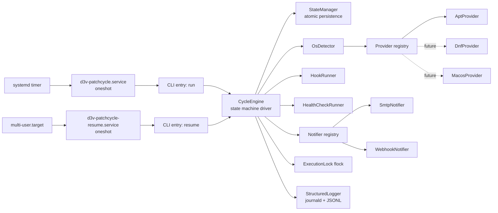

# D3V PatchCycle — System Architecture

Status: Approved baseline for V1
Date: 2026-08-23

---

## 1. Overview

PatchCycle is a short-lived, privileged Python process activated by a native
scheduler (systemd timer) or a boot-resume service (systemd oneshot unit). It
drives a single maintenance cycle through an explicit, persistent state
machine, delegating all OS-specific work to a provider adapter. It never runs
as a daemon and never listens on a network port.



## 2. Components

| Component | Responsibility | Key properties |
|---|---|---|
| `cli` | Argument parsing, exit codes, command dispatch | No business logic |
| `CycleEngine` | Drives the state machine; orchestrates stages | Pure orchestration; no OS specifics |
| `StateManager` | Atomic load/save of cycle state + history | Temp+fsync+rename; schema-versioned |
| `OsDetector` | Produces an `OsIdentity` from os-release/platform | No side effects |
| Provider registry | Maps `OsIdentity` → provider instance | Explicit table; unknown = fail safe |
| `UpdateProvider` impls | refresh/list/apply/reboot-probe/verify | See provider-contract.md |
| `ExecutionLock` | Single-instance guarantee | `flock` on `/run/d3v-patchcycle/lock` |
| `HookRunner` | Admin hooks with timeout + failure policy | argv only, no shell |
| `HealthCheckRunner` | service/http/tcp/command checks | Read-only |
| Notifier registry | Delivers final report to enabled notifiers | Delivery failure ≠ cycle failure |
| `RebootController` | Reboot policy, window checks, boot-id capture, resume-unit verification | The only component allowed to call `systemctl reboot`/`shutdown` |
| `StructuredLogger` | journald (stdout under systemd) + optional JSONL file | `run_id` on every record |
| `ConfigLoader` | TOML load + schema validation | Fails before any maintenance action |
| `Installer` | install/uninstall/schedule unit management | Idempotent |

## 3. Module layout (planned)

```
src/patchcycle/
├── __init__.py            # version
├── __main__.py            # python -m patchcycle
├── cli.py                 # argparse commands, exit codes
├── engine.py              # CycleEngine (state machine driver)
├── states.py              # State enum + transition table
├── state_store.py         # StateManager (atomic JSON persistence)
├── models.py              # dataclasses: OsIdentity, CycleState, UpdateInfo, ...
├── osdetect.py            # OsDetector
├── lock.py                # ExecutionLock (flock context manager)
├── config.py              # ConfigLoader + schema validation
├── logging_setup.py       # structured logging, JSONL formatter
├── reboot.py              # RebootController (policy, boot_id, window)
├── hooks.py               # HookRunner
├── health.py              # HealthCheckRunner + check implementations
├── window.py              # maintenance-window math
├── providers/
│   ├── __init__.py        # registry: select_provider(OsIdentity)
│   ├── base.py            # UpdateProvider abstract contract
│   └── apt.py             # AptProvider (V1)
├── notify/
│   ├── __init__.py        # registry
│   ├── base.py            # Notifier contract
│   ├── smtp.py            # SmtpNotifier
│   └── webhook.py         # WebhookNotifier
├── report.py              # final report model + plain-text rendering
└── installer.py           # install/uninstall, systemd unit rendering
```

Dependency rule: `engine` depends on abstractions (`base.py` contracts);
`providers/` and `notify/` depend on nothing above them. Construction happens
in one composition root (`cli.py`) — dependency injection by constructor,
no globals, no service locator.

## 4. Provider abstraction

Full contract in `docs/specifications/provider-contract.md`. Conceptual shape:

```python
class UpdateProvider(Protocol):
    name: str
    def preflight(self) -> PreflightResult      # PM healthy? locks free? interrupted txn?
    def refresh(self) -> RefreshResult          # update package indexes
    def list_updates(self) -> list[UpdateInfo]  # what would change (no changes made)
    def apply_updates(self, strategy, updates) -> ApplyResult
    def reboot_required(self) -> RebootStatus   # sentinel/native mechanism + reason
    def verify(self) -> VerifyResult            # PM consistency + outstanding count
```

Registry selection: exact `ID` match first, then `ID_LIKE` entries in order,
then unsupported. Providers are only registered when implemented **and**
integration-tested (support honesty rule, FR-02).

## 5. Scheduler abstraction

```python
class SchedulerBackend(Protocol):
    def install(self, schedule: ScheduleSpec) -> InstallResult
    def uninstall(self) -> None
    def is_supported(self) -> bool
    def describe(self) -> str   # human-readable "when will it run"
```

V1 implements `SystemdScheduler` (timer + oneshot service + resume service).
`LaunchdScheduler` is the designed-for macOS future implementation
(`StartCalendarInterval` + `RunAtLoad`). The application itself never waits
for schedules (NFR-07).

systemd units installed by `d3v-patchcycle install`:

| Unit | Type | Purpose |
|---|---|---|
| `d3v-patchcycle.timer` | timer | `OnCalendar=` from `[maintenance]` schedule, `Persistent=true` (catch-up), configurable `RandomizedDelaySec=` |
| `d3v-patchcycle.service` | oneshot | `ExecStart=.../d3v-patchcycle run`; hardening directives (see §10) |
| `d3v-patchcycle-resume.service` | oneshot | `WantedBy=multi-user.target`, `ExecStart=.../d3v-patchcycle resume`; exits 0 immediately when no cycle is pending |

## 6. State manager & reboot/resume architecture

- One state file: `/var/lib/d3v-patchcycle/state.json` (schema v2, see
  `docs/specifications/state-machine.md` §6). At most one active cycle exists;
  completed cycles are archived to
  `/var/lib/d3v-patchcycle/history/<run_id>.json` and `state.json` returns to
  `IDLE` (or is absent, which means IDLE).
- **Write protocol:** serialize → write `<state>.tmp.<pid>` in the same
  directory (mode 0600, `O_NOFOLLOW` checks) → `fsync` file → `os.replace`
  → `fsync` directory. Readers treat a missing/corrupt state file per
  failure-recovery spec (corrupt ≠ "no cycle").
- **Reboot protocol (pre-reboot):** engine transitions to `REBOOTING`,
  recording `boot_id_before` (`/proc/sys/kernel/random/boot_id`),
  `kernel_before`, reboot reason, and expected kernel (if a kernel update was
  applied). Hooks run. Logs flushed. `RebootController` verifies the resume
  unit is enabled **before** allowing reboot. Then `systemctl reboot`
  (preferred; falls back to `shutdown -r`).
- **Resume protocol (post-boot):** `d3v-patchcycle-resume.service` runs
  `d3v-patchcycle resume`. If state shows a non-terminal cycle:
  - current `boot_id` ≠ `boot_id_before` → genuine reboot → continue at
    `POST_REBOOT` (verify kernel transition, then `VERIFYING`).
  - `boot_id` equal and state == `REBOOTING` → the reboot command failed or
    the machine never went down → per failure-recovery FR-S7 (bounded retry,
    then FAILED + notify).
  - Any other non-terminal state with equal `boot_id` → crash recovery per
    failure-recovery spec.
- The resume unit is **always enabled** (not dynamically toggled); it is a
  cheap no-op when no cycle is pending. No cron, no `@reboot`, no dynamic
  unit generation.

## 7. Concurrency control

1. **systemd layer:** a timer that elapses while `d3v-patchcycle.service` is
   active does not start a second instance (systemd.timer semantics,
   verified in research).
2. **Application layer:** `ExecutionLock` takes an exclusive non-blocking
   `flock()` on `/run/d3v-patchcycle/lock`. Held by the process; released
   automatically by the kernel on death — **stale locks are impossible**.
   Second instance → exit code 3.
3. **Package-manager layer:** providers detect apt/dpkg lock contention
   (POSIX record-lock probe on `/var/lib/dpkg/lock-frontend` and friends), wait up to
   `[package_manager].lock_timeout` (default 15m, poll 15s), then abort with
   exit 2 and notify. PatchCycle never kills package processes and never
   deletes lock files.

## 8. Configuration model

TOML, parsed with stdlib `tomllib` (Python 3.11+). Single file
`/etc/d3v-patchcycle/config.toml` (mode 0600 — it may reference secrets).
Full schema in `docs/specifications/configuration.md`. Validation runs before
any maintenance action and in `config-check`; unknown keys are rejected
(strict schema) so typos cannot silently disable safety policy.

Secrets are referenced, not stored: e.g.
`password_env = "PATCHCYCLE_SMTP_PASSWORD"` reads the secret from the process
environment (supplied via systemd `EnvironmentFile=` with 0600 permissions).
Plaintext `password =` is accepted but emits a loud warning and is flagged by
`config-check`.

## 9. Logging model

- Under systemd, log to stdout/stderr → journald automatically, with
  structured fields (`run_id`, `state`, `stage`, `host`, `provider`).
- Optional `[logging].file = "/var/log/d3v-patchcycle/patchcycle.jsonl"`:
  newline-delimited JSON records, one per event.
- Logged per cycle: detected OS, provider, every state transition with
  timestamp, package actions and counts, kernel before/after, reboot
  requirement and occurrence, hook results, health-check results, errors,
  final status.
- **Never logged:** passwords, tokens, webhook secrets, SMTP credentials.
  Notifiers redact credentials from their own debug output. Hook stdout/stderr
  is captured to the log (hooks are admin-configured, trusted-but-audited).

## 10. Security boundaries

PatchCycle runs as root; everything it touches is a trust boundary.
Full analysis in `docs/security/threat-model.md`. Architectural mitigations:

- Subprocess: argv arrays only, `shell=False`, absolute paths resolved once at
  startup from a **fixed** search path, scrubbed child environment.
- Config/state files: ownership root:root enforced, modes enforced at open,
  `O_NOFOLLOW`, no world-readable secrets.
- systemd unit hardening: `ProtectHome=true`, `PrivateTmp=true`,
  `NoNewPrivileges=true` (note: it must retain package-manager and reboot
  capability, so no `ProtectSystem=strict`; documented in threat model).
- Hooks: argv arrays, timeout, no shell; paths must be absolute, root-owned,
  not group/world-writable (validated before execution).

## 11. Error & report model

- Every failure carries: `stage`, `error_kind` (enum: ConfigInvalid,
  UnsupportedPlatform, LockHeld, PmLocked, PmFailed, PreflightFailed,
  HookFailed, RebootFailed, VerifyFailed, HealthCheckFailed, NotifyFailed,
  Internal), human message, and `manual_intervention: bool`.
- Final report (`report.py`) is a plain-text document (email body / webhook
  payload) containing everything an admin needs without logging in:
  result, counts, kernels, reboot outcome, outstanding updates, health
  results, failures, and recommended action.
- Cycle outcomes: `SUCCESS`, `SUCCESS_WITH_WARNINGS` (e.g. notification
  failed, non-critical health check failed), `NO_UPDATES`, `FAILED`,
  `BLOCKED`, `MANUAL_REBOOT_REQUIRED` (exit 6 path).

## 12. Extensibility (non-goals preserved)

The provider/scheduler/notifier/health-check registries are the only
extension seams. A future fleet product would consume the JSONL history and
report model without changing this tool's local-first behaviour.
